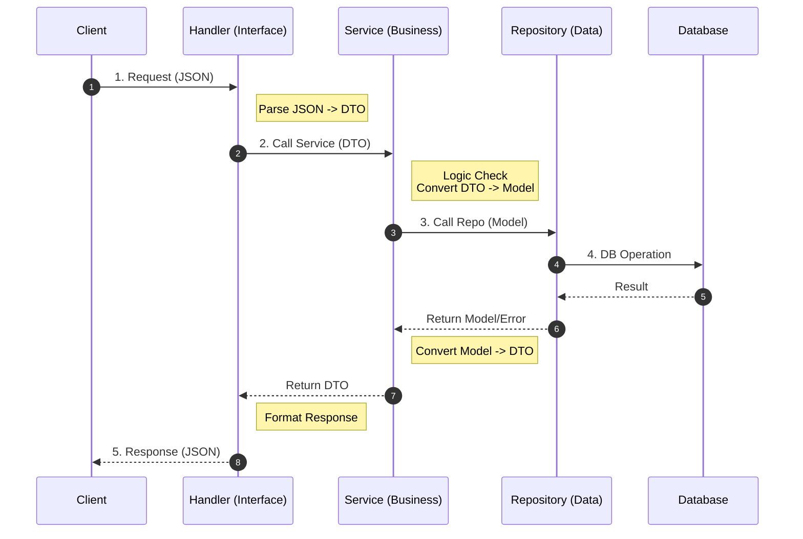

# Mall API

基于 Go 和 Gin 构建的企业级 RESTful API 商城应用后端。

## 技术栈

*   **语言**: Go 1.25+
*   **Web 框架**: [Gin](https://github.com/gin-gonic/gin) - 高性能 HTTP Web 框架
*   **ORM**: [GORM](https://gorm.io/) - Go 语言优秀的 ORM 库
*   **数据库**: PostgreSQL
*   **认证**: 双 Token 认证 (JWT Access Token + Refresh Token)
*   **缓存/KV存储**: [go-redis](https://github.com/redis/go-redis) - 官方推荐的 Redis 客户端
*   **日志**: [log/slog](https://pkg.go.dev/log/slog) - Go 1.21+ 标准库结构化日志
*   **操作系统/工具**: Linux/macOS
*   **文档**: Swagger / OpenAPI (通过 `swaggo`)

## 项目结构最佳实践

本项目采用 **领域驱动设计 (DDD)** 结合 **整洁架构** 的思想，按照业务领域进行拆分，并对 API 版本进行管理。这种结构确保了代码的高内聚、低耦合以及良好的可扩展性。

### 目录结构说明

```bash
mall-api/
├── cmd/                  # 应用程序入口
│   └── server/
│       └── main.go
├── internal/
│   ├── app/              # 核心业务逻辑（按领域划分）
│   │   ├── user/         # [User 领域]
│   │   │   ├── v1/       # API 版本控制
│   │   │   │   ├── handler.go    # 接口层：处理 HTTP 请求与响应
│   │   │   │   ├── service.go    # 业务层：具体的业务逻辑实现
│   │   │   │   ├── dto.go        # 数据传输对象：定义 API 输入输出结构
│   │   │   │   └── router.go     # 路由层：注册该领域的路由
│   │   │   ├── model.go          # 领域模型：数据库实体定义
│   │   │   └── repository.go     # 仓储层接口与实现：屏蔽底层数据库差异
│   │   └── auth/         # [Auth 领域]
│   ├── config/           # 配置定义与加载
│   ├── database/         # 数据库连接组件
│   ├── router/           # 全局路由入口
│   └── pkg/              # 内部共享工具包
├── pkg/                  # 公共库（可被外部引用）
├── api/                  # OpenAPI/Swagger 接口文档
└── Makefile             # 项目管理命令
```

## 开发最佳实践

### 1. 命名规范

*   **Go 语言命名**: 遵循 `CamelCase`（驼峰命名法）。
    *   **导出变量/函数**: 首字母大写 (e.g., `UserRepository`, `CreateUser`).
    *   **私有变量/函数**: 首字母小写 (e.g., `db`, `parseToken`).
    *   **接口**: 通常以 `er` 结尾，或明确表示其行为 (e.g., `Reader`, `Service`).
    *   **目录命名**: 推荐使用 **全小写**，尽量使用 **单个单词** (e.g., `user`, `config`)。
    *   **文件命名**: 推荐使用 **单个单词** 或 **下划线连接多个单词** (snake_case) (e.g., `handler.go`, `user_service.go`)。

### 2. RESTful API 规范

本项目严格遵循 RESTful 风格，仅使用以下四种 HTTP 方法。

*   **URL 设计**: 使用 **复数名词** 表达资源，路径 **全小写** (e.g., `/app/v1/users`)。
*   **方法使用**:

    | 方法 | 描述 | 适用场景 | 示例 |
    | :--- | :--- | :--- | :--- |
    | **GET** | 查询资源 | 获取列表、获取详情 | `GET /users` (列表)<br>`GET /users/:id` (详情) |
    | **POST** | 创建资源 | 新增一条数据 | `POST /users` |
    | **PUT** | 更新资源 | 修改现有数据 (全量或部分更新) | `PUT /users/:id` |
    | **DELETE** | 删除资源 | 删除一条数据 | `DELETE /users/:id` |

> **注意**: 不使用 `PATCH` 等其他方法。统一使用 `PUT` 处理更新操作。

### 3. 分层架构与数据流

本项目采用严格的分层架构，数据流向单向依赖：`Router -> Handler -> Service -> Repository -> Database`。

#### 3.1 各层职责划分

*   **Handler 层 (接口层)**:
    *   **职责**: 解析 HTTP 请求参数 (DTO)，进行基础参数校验，调用 Service 层方法，封装统一响应格式。
    *   **禁止**: 禁止包含复杂业务逻辑，禁止直接访问数据库。
    *   **依赖**: 依赖 `Service` 接口。

*   **Service 层 (业务层)**:
    *   **职责**: 核心业务逻辑实现，事务控制，数据组装，编排 Repository 层接口。
    *   **设计**: 定义并实现 Service 接口，保证可测试性。
    *   **依赖**: 依赖 `Repository` 接口。

*   **Repository 层 (仓储层)**:
    *   **职责**: 负责数据的持久化操作 (CRUD)，屏蔽底层存储细节 (GORM/SQL/Redis)。
    *   **设计**: 实现 Domain 层定义的 Repository 接口。
    *   **禁止**: 禁止包含业务逻辑。

*   **Model (数据模型)**:
    *   **职责**: 定义与数据库表一一对应的结构体 (Struct)，包含 GORM 标签。
    *   **位置**: 通常位于领域层 `internal/app/{domain}/model.go`。

*   **DTO (数据传输对象)**:
    *   **职责**: 定义 API 输入参数 (Request) 和输出响应 (Response) 的结构。
    *   **目的**: 将 HTTP 接口契约与底层数据库模型解耦，防止 API 变更影响数据库，反之亦然。
    *   **位置**: 通常位于版本层 `internal/app/{domain}/v1/dto.go`。

#### 3.2 数据流向图 (Data Flow)

以下展示了从 **请求进入** 到 **响应返回** 的完整流程，以及各层之间的数据载体变化。



**关键转换节点**:
1.  **入口 (Handler)**: `JSON` (外部) -> `DTO` (内部交互)。
2.  **业务 (Service)**: `DTO` (传输) -> `Model` (领域实体)。
3.  **持久化 (Repo)**: `Model` -> `SQL/DB Record`。
4.  **返回**: 逆向转换 `Model` -> `DTO` -> `JSON`。


### 4. 统一响应格式

所有 API 接口返回的数据结构保持一致，推荐使用 `internal/pkg/network` 包中的辅助函数 `network.OK` (不分页)、`network.OKWithPage` (分页) 以及 `network.Fail` (失败) 进行处理。

#### 4.1 基础结构（不分页）

适用于单个资源查询、创建、更新、删除等操作。

```go
// 示例代码
network.OK(c, &network.OKOption{
    Data: user,
})
```

**响应示例**:
```json
{
  "code": 0,
  "message": "success",
  "data": {
    "uid": "u123",
    "nickname": "TopG"
  },
}
```

#### 4.2 分页结构

适用于列表查询，包含分页元数据。

```go
// 示例代码
network.OKWithPage(c, &network.PageOption{
    Data:  users,
    Page:  1,
    Size:  10,
    Total: 100,
})
```

**响应示例**:
```json
{
  "code": 0,
  "message": "success",
  "data": [
    { "uid": "u1", "nickname": "User1" },
    { "uid": "u2", "nickname": "User2" }
  ],
  "page": 1,
  "size": 10,
  "total": 100,
}
```

#### 4.3 错误响应

适用于业务逻辑错误或系统异常。

```go
// 示例代码
network.Fail(c, &network.FailOption{
    Code:    network.Unauthorized,
    Message: "Token 已过期或无效",
})
```

**响应示例**:
```json
{
  "code": 40001,
  "message": "Token 已过期或无效",
  "data": null,
}
```

## 数据库最佳实践

*   **命名规范**:
    *   **表名**: 使用 **单数名词** + **全小写** + **下划线分隔**。例如: `user`, `product`, `user_profile`。
    *   **列名**: 使用 **全小写** + **下划线分隔** (snake_case)。例如: `created_at`, `user_id`, `status`。
    *   **主键**: 统一命名为 `id` (bigint/uuid)，业务主键可命名为 `uid` 或 `order_no`。
*   **外键**: 尽量在应用层维护关联关系，高并发场景下减少物理外键约束。

## Redis 最佳实践

### 1. 引入与初始化

Redis 连接初始化位于 `internal/database/redis.go`，配置位于 `internal/config/redis.go`。推荐使用 `go-redis` 库进行操作。

*   **配置**: 使用 `RedisConfig` 结构体管理地址、密码和 DB。
*   **连接**: 在 `main.go` 中初始化，并将其注入到 `Router` 中，最终传递给 `Service` 或 `Repository` 层使用。

### 2. 使用场景

Redis 应当仅用于缓存、临时数据存储或特定的高性能需求场景，**严禁**作为持久化主数据存储（除非有充分理由）。

*   **缓存 (Caching)**: 缓存热点数据（如用户信息、商品详情），减少数据库压力。必须设置过期时间 (TTL)。
*   **会话管理 (Session)**: 存储短期有效的 Token 白名单/黑名单。
*   **分布式锁 (Distributed Lock)**: 处理高并发下的资源竞争。
*   **限流 (Rate Limiting)**: 防止恶意刷接口。
*   **排行榜 (Leaderboard)**: 利用 ZSet 实现高性能排行榜。

### 3. Key 命名规范

类似于数据库表名，Redis Key 也需要规范命名以防止冲突和方便管理。

*   **格式**: `项目名:模块名:业务名:唯一标识` (使用冒号分隔)
*   **示例**:
    *   `mall:auth:token:u123` (用户 u123 的 Token)
    *   `mall:prod:detail:p888` (商品 p888 的详情缓存)
    *   `mall:sms:code:13800000000` (手机验证码)

### 4. 代码示例

在 Repository 层中使用 Redis：

```go
func (r *userRepository) GetUserCache(ctx context.Context, uid string) (*model.User, error) {
    key := fmt.Sprintf("mall:user:info:%s", uid)
    val, err := r.rdb.Get(ctx, key).Result()
    if err == redis.Nil {
        return nil, nil // 缓存未命中
    } else if err != nil {
        return nil, err // 其它错误
    }
    
    // 反序列化
    var user model.User
    json.Unmarshal([]byte(val), &user)
    return &user, nil
}
```

## Git 协作规范

本项目采用 **Conventional Commits** 规范提交代码，格式为 `<type>(<scope>): <subject>`。

### Commit Types

*   `feat`: ✨ 新增功能 (A new feature)
*   `fix`: 🐛 修复 Bug (A bug fix)
*   `docs`: 📚 文档变更 (Documentation only changes)
*   `style`: 💎 代码格式调整 (Changes that do not affect the meaning of the code)
*   `refactor`: ♻️ 代码重构 (A code change that neither fixes a bug nor adds a feature)
*   `perf`: 🚀 性能优化 (A code change that improves performance)
*   `test`: 🚨 测试相关 (Adding missing tests or correcting existing tests)
*   `chore`: 🔧 构建/工具变动 (Changes to the build process or auxiliary tools)

### Subject 规范

1.  使用 **祈使句**，**一般现在时** (e.g., "change" not "changed" nor "changes")。
2.  首字母 **不要大写**。
3.  结尾 **不要句号** (.)。
4.  语言: 推荐使用 **英文**。

**示例**:
> `feat(user): implement login api`
> `fix(db): resolve connection timeout`
> `docs(readme): update project structure`

## 运行与配置

### 前置要求

*   Go 1.25+
*   PostgreSQL
*   Redis

### 启动项目

1.  **安装依赖**:
    ```bash
    go mod tidy     # 整理依赖 (添加缺失模块，移除未使用模块)
    go mod download # 下载依赖到本地缓存
    ```

2.  **运行应用**:
    使用 Makefile 快捷命令启动服务器：
    ```bash
    make run
    ```

3.  **生成文档**:
    更新并生成 Swagger API 文档：
    ```bash
    make swag
    ```
